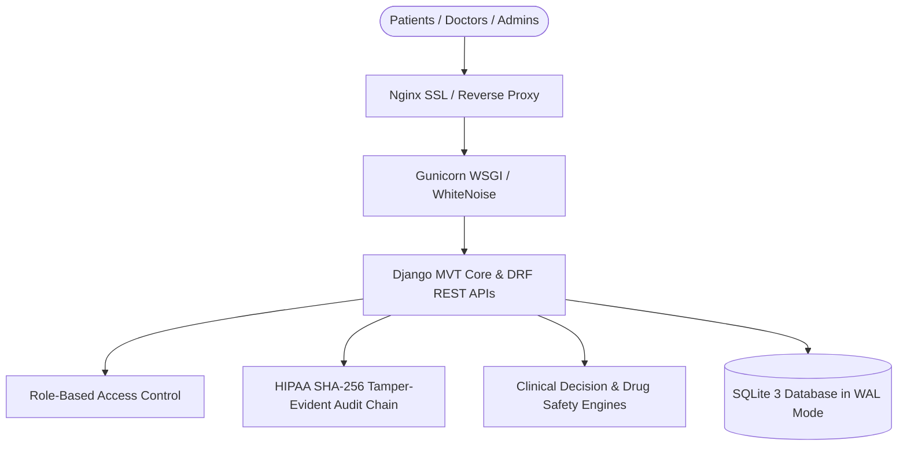

# HealthSphere Enterprise Healthcare Platform Architecture

## Executive Architecture Overview
HealthSphere is an enterprise-grade full-stack electronic health records (EHR), hospital information system (HIS), and clinical decision support platform built on Python 3.11, Django 5.x MVT architecture, Django REST Framework (DRF), and SQLite in Write-Ahead Logging (WAL) mode.

## Domain Modules
1. **Accounts & RBAC**: Custom UUID users with role isolation (ADMIN, DOCTOR, NURSE, PATIENT, PHARMACIST, LAB_TECH, BILLER, RECEPTIONIST).
2. **Audit & Compliance**: Tamper-evident cryptographic SHA-256 hash chaining conforming to HIPAA Security Rule 45 CFR 164.312(b).
3. **Facilities**: Multi-facility management, wards, rooms, and real-time bed occupancy tracking.
4. **Doctors & Scheduling**: NPI registry, multi-site availability matrices, conflict detection, and consultation fees.
5. **Patients & EHR**: MRN generation, structured medical/surgical history, vital signs with physiological BMI and MAP calculations.
6. **Appointments**: Atomic locking slot booking engine and live queue tokens.
7. **Clinical Records**: Encounter tracking, digitally signed SOAP notes, ICD-10 diagnostic coding.
8. **Prescriptions**: Tamper-signed electronic prescriptions with dosage and route specifications.
9. **Pharmacy & Inventory**: WHO ATC formulary catalog, batch tracking, expiry monitoring, and dispensation records.
10. **Laboratory**: LOINC-coded catalog, age/sex demographic reference bounds, auto-flagging of critical panic values.
11. **Billing & Invoicing**: Itemized invoicing, fee schedules, multi-mode payment settlements, and patient ledger.
12. **Insurance**: Provider registries, patient coverage policies, and automated claim adjudication.
13. **Notifications**: Multi-channel notification delivery.
14. **Analytics**: Real-time hospital operational metrics, bed occupancy, ALOS, clean claim ratios, and pharmacy turnover.
15. **Clinical AI Decision Support**: Manchester Triage System (MTS/ESI 5-level), drug-drug interaction matrix, allergy contraindications, and ASCVD risk scoring.
16. **API & Interoperability**: OpenAPI 3.0 / Swagger specification via DRF-Spectacular.
